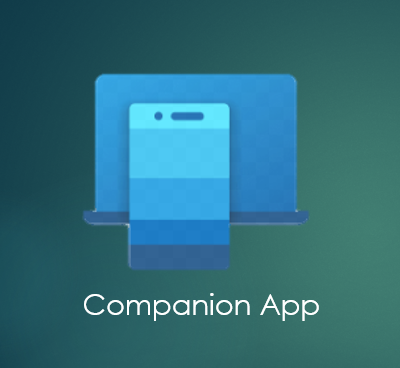

# Companion App

Are you annnoyed to look phone every now and then while working?

Here is a great solution - [**Companion App**](). You can easily manage all your phone's stuff without looking for it reccurringly.
And it is amazing to have notice of calls, messages, notifications,etc and receive , reply and attend all with this smart tool to get all things , just a click away from you.

## Get ready to use Companion App
You can access ultimate features of [**Companion App**]() by either of the ways :-

### a) Using your Phone

1. Go to your browser.
2.  Search for aka.ms/yourpc on it .
3. Download **"Link to Windows"** from there.
4. Now, go to PC browser and search for [**Companion App**]().
5. A QR Code appears on your PC.
6. Scan the QR Code.
7. Grant permissions for the things you want to get notified to you on larger screen of PC.

### b) Using your PC

1. Launch **'Settings'** app > Click 'Bluetooth & devices'.
2. Under 'Your Phone' click on'Open Your Phone'.
3. Go and Sign in [**Companion App**]().
4. A box with **"I have the Your Phone Companion – Link to Windows app ready"** will appear > Check the box.
5.  Tap on **'Pair with QR code'**.
6. Now scan the QR Code via smartphone.
7. Thenafter, both PC &Phone will get paired.
8. Tap **'Continue'** on phone .
9. Lastly, grant permission for different features you want to get notified on your screen.
10. Tap DONE.
11. At last **'You’re all set!'** notification appears on PC.

## Prerequisites to use Companion App

To enjoy ultimate features of [**Companion App**]() you ned to have certain things ready:-

### Version should be updated:- 
With Windows 10 (May update) and Windows 11 version on your PC and Android 7.0 (Nougat) or later version for your mobile phone.

### Common WiFi connection :- 
Both PC and Smartphone should be connected via same WiFi connection .

                                         
        **Get ready to advent new way of work management !**
